# Generative / Procedural Methods

Here shows some of my exploration:

Modelling of fjord:

|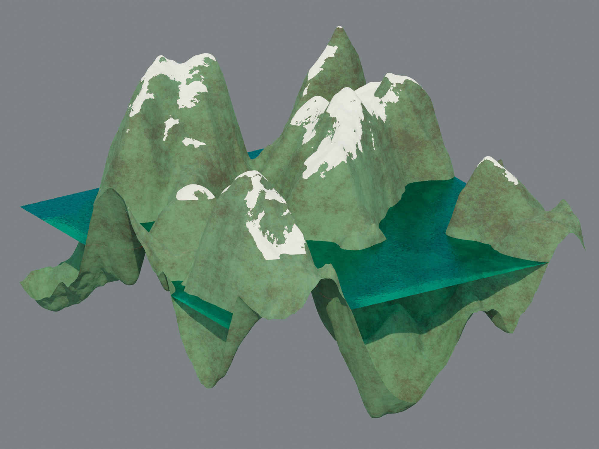 | 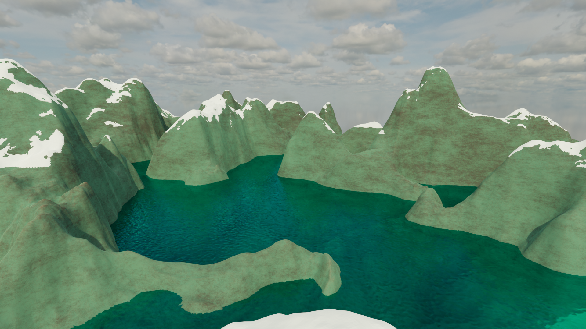 |
|:--:|:--:|

Modelling of POKEMEN Magnemite

|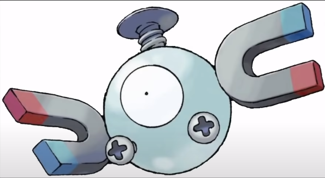 |  |
|:--:|:--:|

Modelling of Tile rooftop:

|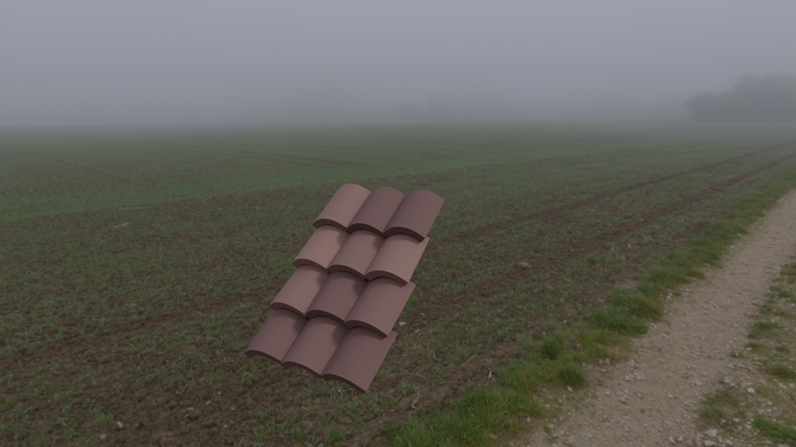 | 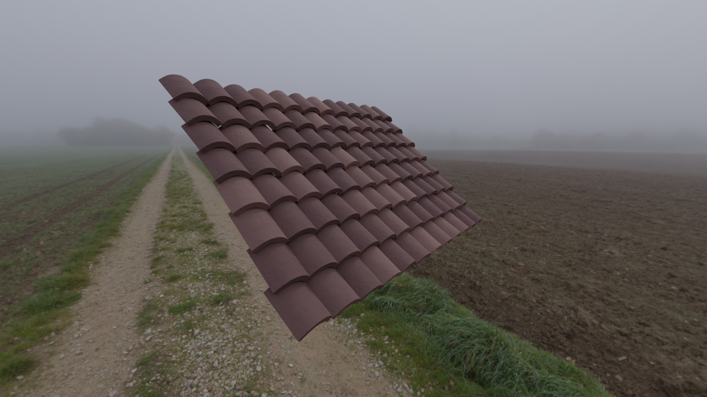 |
|:--:|:--:|

Texture generation (marble) from machine learning based GAN:

|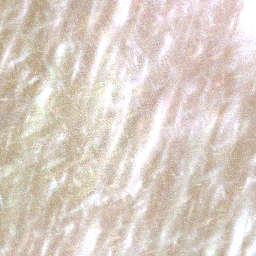 | 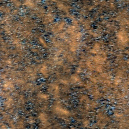 |
|:--:|:--:|

WFC method of 2d/3d iamge/3d generation in python implementaion/blender implementation (non ML):

|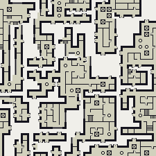 | 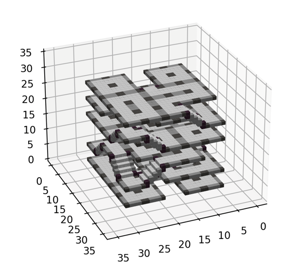 |
|:--:|:--:|

WFC Blender tweaks:
|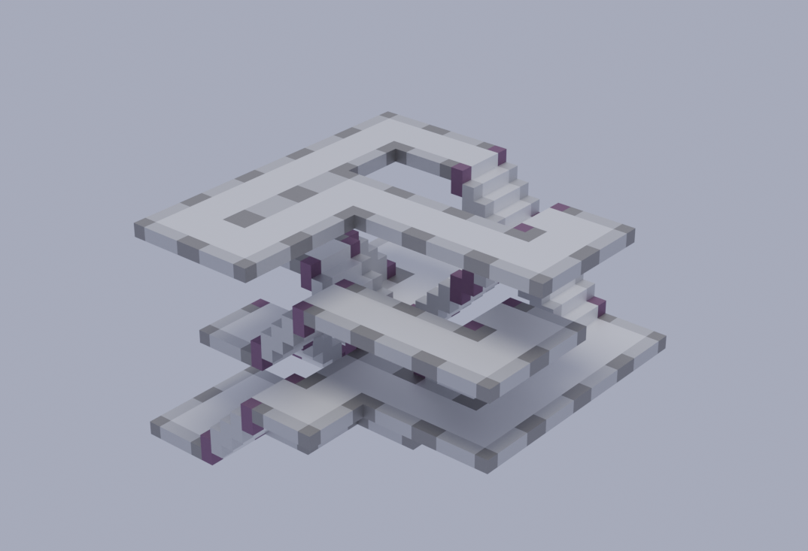 | 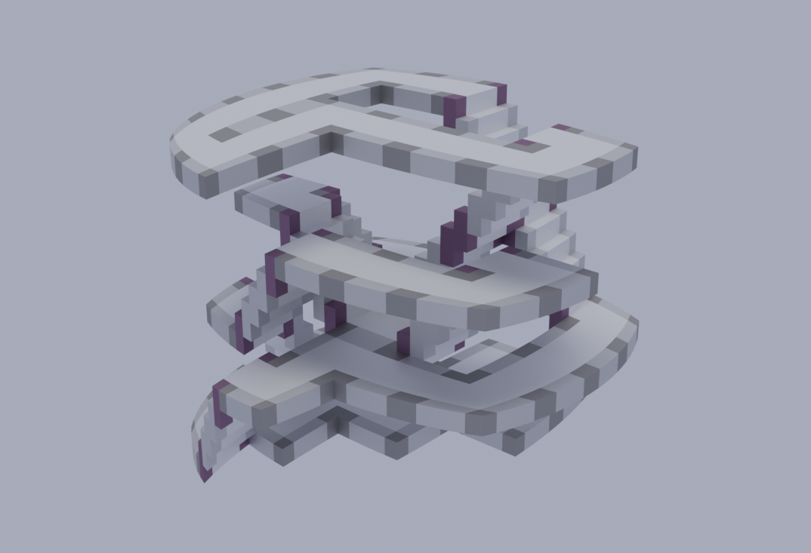 |
|:--:|:--:|

Wfc other tilesets
| | 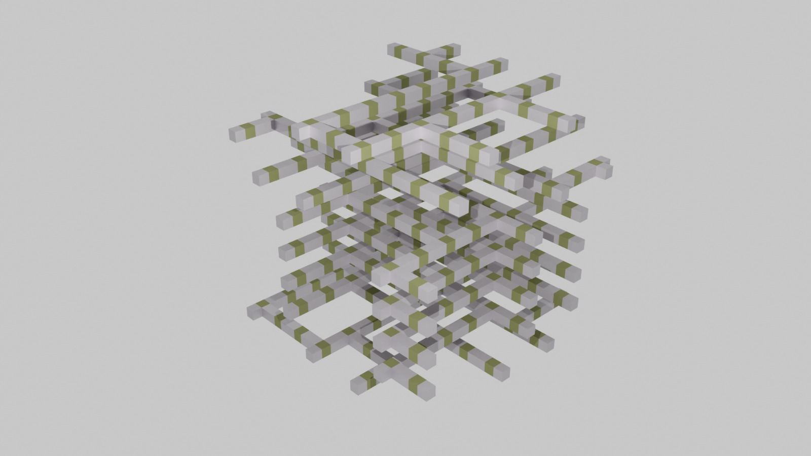 |
|:--:|:--:|

Wave simulation :

try cliking on the canvas and start
<iframe width="800" height="600" frameborder="0" src="https://www.shadertoy.com/embed/cstSz7?gui=true&t=10&paused=true&muted=false" allowfullscreen></iframe>

<!-- <iframe width="800" height="600" frameborder="0" src="https://www.shadertoy.com/embed/cdKBzG?gui=true&t=10&paused=true&muted=false" allowfullscreen></iframe> -->

Reaction diffusion with different parameters for life like effects:

|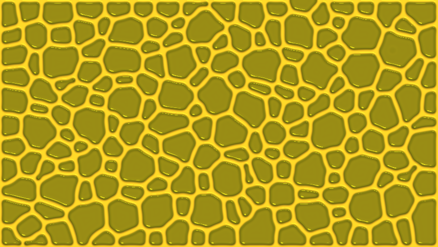 | 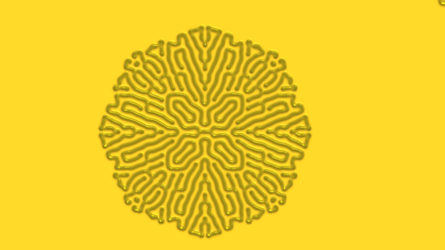 |
|:--:|:--:|