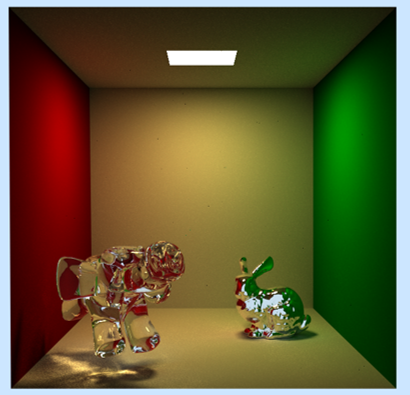
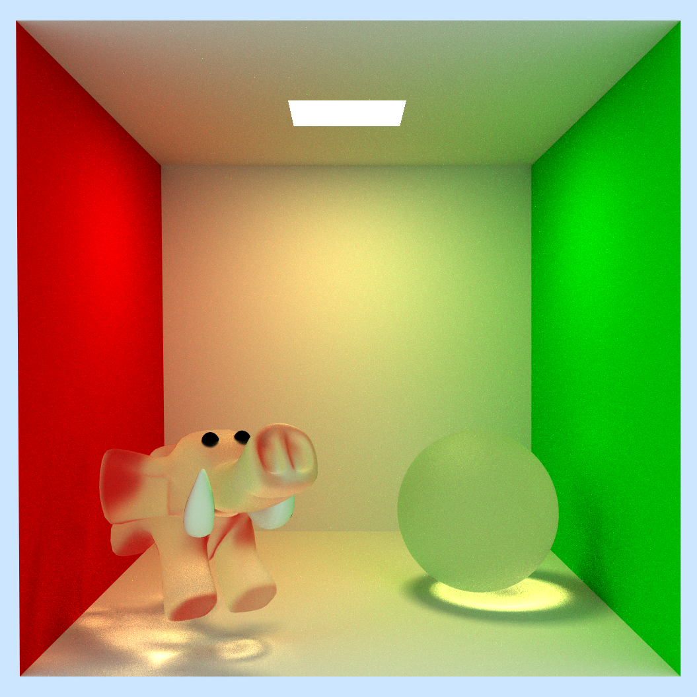
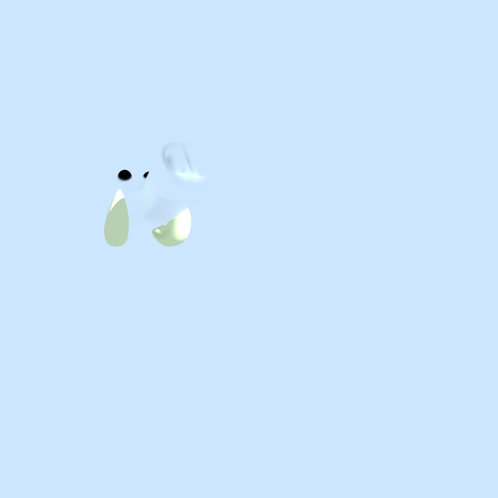
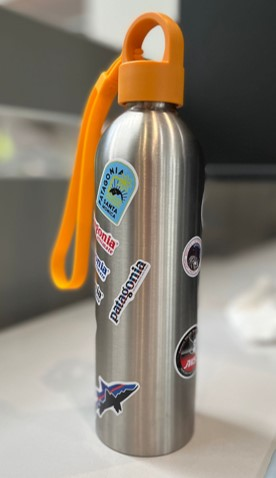
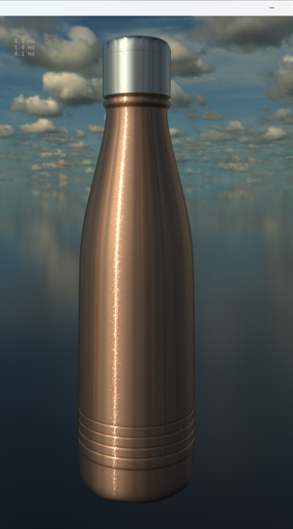
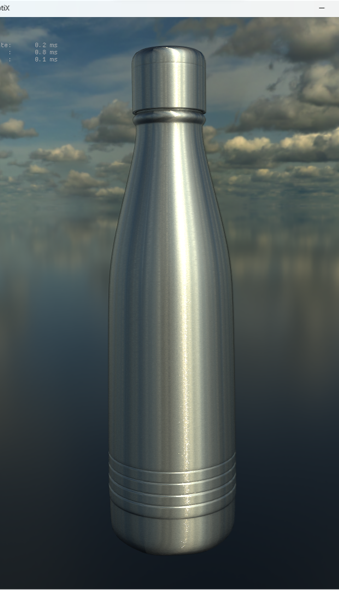
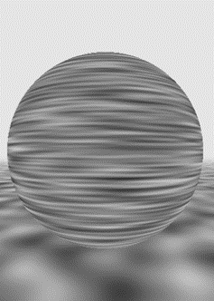
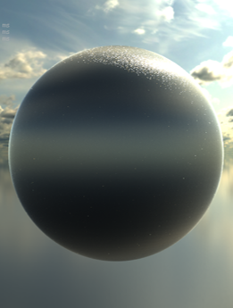
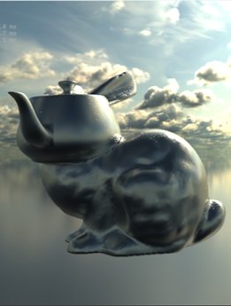
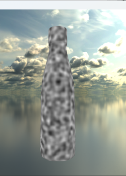

<!-- Rendering of transparent and metal material in cornell box
 -->

Rendering of elephant and bunny in optix path tracing framework and cuda, with multiple scattering shader implemented from [Eric Heitz's Research Page (wordpress.com)](https://eheitzresearch.wordpress.com/240-2/)

Testing of energy conservative for microfacet models.

Rendering of realistic steel bottle from my life:

| |  |   |
|:--:|:--:|:--:|

A more detail look:

This comprises several parts to put them together
1. Real life ior values for metal (steel and copper)
2. microfacet models for realistic objects, also with anisotropic parameters.
3. noise functions for varying values of anisotropy.

future plans:
4. scratches and etches with generated normal map

Here lists some experiments images when I was trying to make this work:

| |  |   |  |
|:--:|:--:|:--:|:--:|
